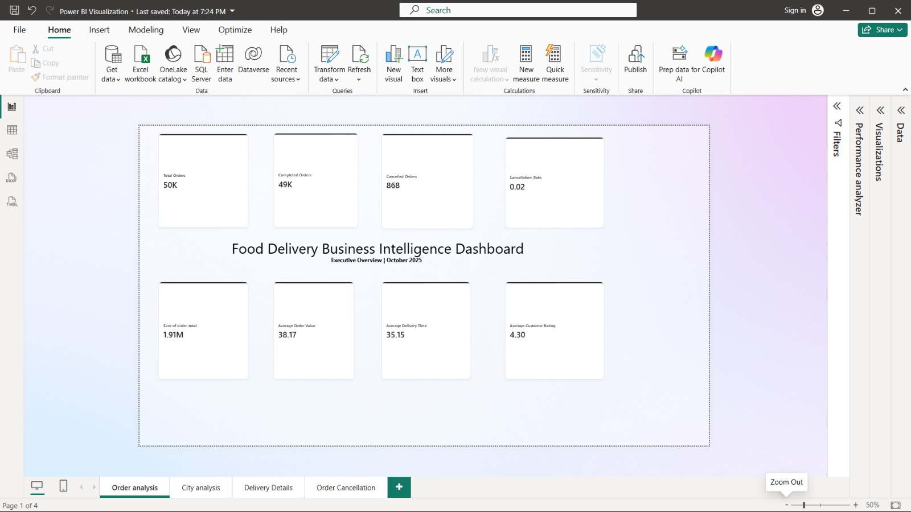
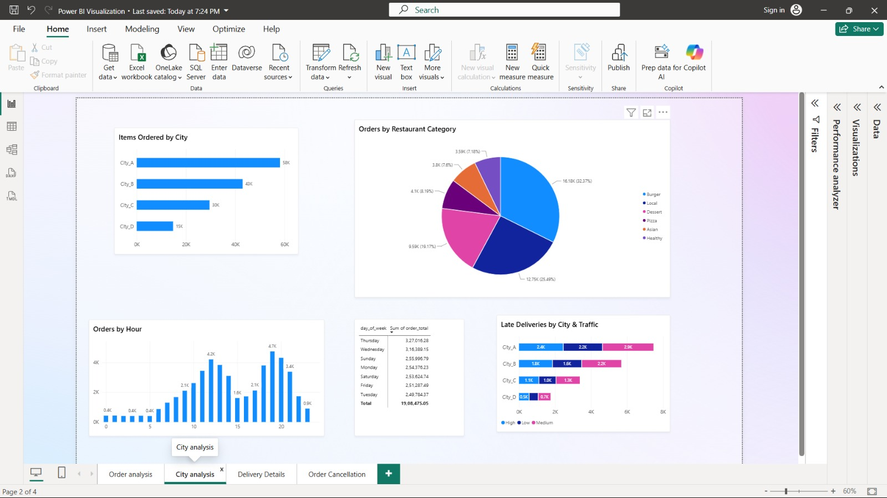

# 🍽️ Food Delivery Data Analytics

> **An end-to-end data analytics project --- from a raw Kaggle dataset
> to a cleaned analytical dataset, deep Excel analysis, a written
> business report, and an interactive Power BI dashboard.**

This project was built to follow a realistic **data analyst workflow**,
rather than jumping straight into visualization.

The idea was simple:

**Raw data → understand it → clean it → analyze it deeply → communicate
the findings → visualize them interactively.**

------------------------------------------------------------------------

## 📌 Project Overview

The dataset contains **50,000 food-delivery orders** with information
about cities, restaurant types, food categories, order status,
cancellation reasons, delivery performance, traffic, weather, tips,
ratings, and timestamps.

I worked through the dataset in multiple stages:

``` text
Kaggle Dataset
      ↓
Python — Data Cleaning & Basic EDA
      ↓
Cleaned Dataset
      ↓
Excel — Deep Analysis
      ↓
ODT — Detailed Analysis Report
      ↓
Power BI — Data Modeling + DAX + Visualization
      ↓
4-Page Interactive Dashboard
```

This separation was intentional. Each tool had a specific role in the
analysis.

------------------------------------------------------------------------

# 🧰 Tools & Technologies

  -----------------------------------------------------------------------
  Tool                                Purpose
  ----------------------------------- -----------------------------------
  🐍 **Python / Pandas / NumPy**      Data inspection, cleaning and basic
                                      EDA

  📊 **Microsoft Excel**              Deep exploratory and business
                                      analysis

  📝 **LibreOffice Writer (ODT)**     Documenting findings and business
                                      insights

  📈 **Microsoft Power BI**           Data modeling, DAX and interactive
                                      visualization

  📁 **CSV / XLSX**                   Data storage and analytical outputs

  📓 **Jupyter Notebook**             Reproducible Python analysis
  -----------------------------------------------------------------------

------------------------------------------------------------------------

# 🔄 My Analysis Workflow

## 1. Raw Dataset --- Kaggle

I started with the original food-delivery dataset and first inspected
its structure rather than immediately modifying it.

The initial stage included:

-   Loading the CSV with Pandas
-   Checking dataset shape
-   Inspecting column information and data types
-   Looking at descriptive statistics
-   Checking city distribution
-   Checking order-status distribution
-   Checking duplicate order IDs
-   Checking duplicate rows
-   Identifying columns containing missing values

The original dataset is preserved in the repository as:

`food_delivery_orders_dataset.csv`

------------------------------------------------------------------------

## 2. Python --- Cleaning & Basic EDA

The Python stage was focused on **understanding the raw data and
preparing a reliable dataset for the later analysis**.

### Main cleaning work

-   Filled missing cancellation reasons with `Not Cancelled`
-   Filled missing tip amounts with `0`
-   Handled missing delivery-time values
-   Handled missing late-delivery values
-   Handled missing customer ratings
-   Converted `order_date` to datetime
-   Converted `order_timestamp` to datetime
-   Performed a final missing-value check
-   Exported the cleaned dataset

The cleaned output is:

`new_food_delivery_orders_cleaned.csv`

### Python notebook

`Data_analysis.ipynb`

### Python screenshots


------------------------------------------------------------------------

# 📊 3. Excel --- Deep Analysis

After cleaning the dataset, I moved the **cleaned data into Excel for
deeper analysis**.

This stage was not just about making charts. I used Excel to investigate
the business questions hidden inside the dataset and calculate detailed
findings that would later become the foundation of the written report
and Power BI dashboard.

Areas explored included:

-   City performance
-   Restaurant/category performance
-   Order status
-   Cancellation reasons
-   Delivery performance
-   Delivery conditions
-   Tips
-   Customer and restaurant ratings
-   Time-of-day patterns
-   Day-of-week performance
-   Order value patterns

### Excel analysis screenshots


------------------------------------------------------------------------

# 📝 4. Analysis Report

The Excel findings were then turned into a structured **Data Analysis
Report**.

The report explains not only *what happened in the data*, but also the
patterns that matter from a business perspective.

The report covers:

-   City analysis
-   Restaurant analysis
-   Day-of-week analysis
-   City + day analysis
-   Category and order-status analysis
-   Cancellation analysis
-   Delivery analysis
-   Tip and rating analysis
-   Time analysis

File:

`Data_Analysis_Report.odt`

### Report screenshots


------------------------------------------------------------------------

# 📈 5. Power BI --- Final Visualization Layer

The final stage was building an interactive Power BI report from the
cleaned data.

This is where I moved from static analysis into **interactive business
intelligence**.

I created:

-   A data model
-   DAX measures
-   Calculated analytical metrics
-   Interactive visualizations
-   Filters/slicers
-   Four dedicated dashboard pages

The Power BI file is:

`Power BI Visualization.pbix`

------------------------------------------------------------------------

# 🖥️ Power BI Dashboard

## Page 1 --- Order Analysis

This page focuses on the overall order picture and provides a high-level
view of order volume and order value.



------------------------------------------------------------------------

## Page 2 --- City Analysis

This page looks at how the different cities contribute to completed
order value and overall business performance.



------------------------------------------------------------------------

## Page 3 --- Delivery Analysis

This page focuses on delivery performance, including delivery time, late
deliveries, and the impact of conditions such as traffic and weather.


------------------------------------------------------------------------

## Page 4 --- Cancellation Analysis

This page examines cancelled orders and the reasons behind them, helping
identify where operational problems are concentrated.


------------------------------------------------------------------------

# 🔎 Key Findings

A few findings that stood out during the analysis:

### 🏙️ City performance

-   **City_A** was the strongest-performing city, generating
    approximately **₹717.7K** in completed order value.
-   **City_A + City_B** together contributed approximately **70.4%** of
    completed order value.
-   **City_D** had the lowest completed order value at approximately
    **₹214.5K**.

### 🍔 Restaurant & category performance

-   **Fast Food** generated the highest completed order value at
    approximately **₹898.6K**.
-   **Casual Dining** followed with approximately **₹672.7K**.
-   **Burger** was the highest-value food category at approximately
    **₹538.7K**.

### ❌ Cancellations

-   There were **868 cancelled orders** out of 50,000 total orders.
-   **Driver Unassigned** was the largest cancellation reason,
    accounting for approximately **44.5%** of cancellations.
-   Overall cancellation rate was approximately **1.7%**.

### 🚚 Delivery performance

-   Average estimated delivery time: **30.92 minutes**
-   Average actual delivery time: **35.15 minutes**
-   Average difference: approximately **4.23 minutes**
-   Approximately **36.6%** of completed orders were classified as late.
-   Storm conditions had the highest average delivery time at
    approximately **47.07 minutes**.
-   High traffic was associated with longer average delivery times.

### ⭐ Tips & ratings

-   Completed orders generated approximately **₹79.1K** in total tips.
-   Average customer rating: **4.30 / 5**
-   Average restaurant rating: **4.21 / 5**
-   Delivery partners had the highest average rating at **4.50 / 5**.

### 🕒 Time analysis

-   **Evening** was the highest-value time period at approximately
    **₹559.1K**.
-   **7 PM** was the strongest individual ordering hour at approximately
    **₹179.5K**.
-   **Thursday** was the strongest day, generating approximately
    **₹319.8K**.
-   The strongest day/hour combination was **Thursday at 7 PM**,
    generating approximately **₹32.2K**.

------------------------------------------------------------------------

# 💡 What This Project Demonstrates

This project is more than a collection of charts.

It demonstrates the complete analytical chain:

**Question → Data → Cleaning → Analysis → Insight → Communication →
Visualization**

It also demonstrates experience with:

-   Data cleaning
-   Missing-value handling
-   Data type correction
-   Exploratory data analysis
-   Business-oriented analysis
-   Excel-based analytical work
-   Data storytelling
-   Power BI data modeling
-   DAX measures
-   Dashboard design
-   Translating analytical findings into business insights

------------------------------------------------------------------------

# 📂 Project Structure

``` text
Food Data analystics/
│
├── food_delivery_orders_dataset.csv
│
├── Data_analysis.ipynb
│
├── new_food_delivery_orders_cleaned.csv
│
├── new_food_delivery_orders_cleaned .xlsx
│
├── Data_Analysis_Report.odt
│
├── Power BI Visualization.pbix
│
└── ScreenShots/
    │
    ├── Code/
    │   ├── Importing libraries.png
    │   ├── Basic info.png
    │   ├── Checking columns.png
    │   ├── Missing Values.png
    │   ├── Data Cleaning.png
    │   └── FIxing datatype and final check.png
    │
    ├── Excel/
    │   ├── City Analysis.png
    │   ├── Category and status of order .png
    │   ├── Delivery Details.png
    │   ├── Cancellation Reason.png
    │   ├── TIp Analysis.png
    │   └── Time analysis.png
    │
    ├── Report/
    │   ├── Page 1.png
    │   ├── Page 2.png
    │   └── Page 3.png
    │
    └── PowerBI/
        ├── Order_Analysis.jpeg
        ├── City_Analysis.jpeg
        ├── Delivery_Analysis.jpeg
        └── Cancellation_Analysis.jpeg
```

------------------------------------------------------------------------

# 🚀 How to Explore the Project

If you want to follow the project in the same order in which it was
created:

### Step 1

Open:

`Data_analysis.ipynb`

Start with the raw dataset inspection and cleaning.

### Step 2

Open:

`new_food_delivery_orders_cleaned.csv`

This is the cleaned analytical dataset produced by the Python stage.

### Step 3

Open:

`new_food_delivery_orders_cleaned .xlsx`

Explore the deeper Excel analysis.

### Step 4

Read:

`Data_Analysis_Report.odt`

This contains the written interpretation of the analytical findings.

### Step 5

Open:

`Power BI Visualization.pbix`

Explore the four-page interactive dashboard and the underlying
DAX/modeling work.

------------------------------------------------------------------------

# 🎯 Final Outcome

The final result is an end-to-end food delivery analytics project that
takes a raw dataset and turns it into a **cleaned dataset, detailed
analysis, documented business insights, and an interactive Power BI
report**.

The most important part for me was not simply producing a dashboard.

It was building the workflow behind it:

> **Clean the data first. Understand it deeply. Find the story in the
> numbers. Then build the visualization around that story.**

------------------------------------------------------------------------

## 👤 Author

**Sai Satyam**

Data Analytics Project\
Python • Pandas • NumPy • Excel • Power BI • DAX
